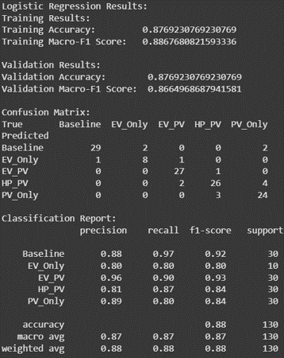
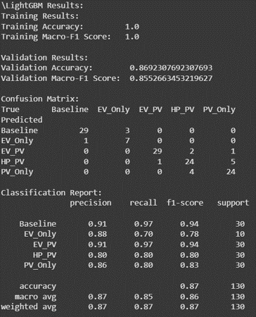
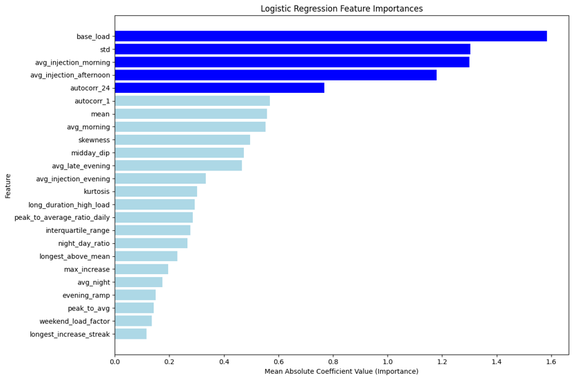
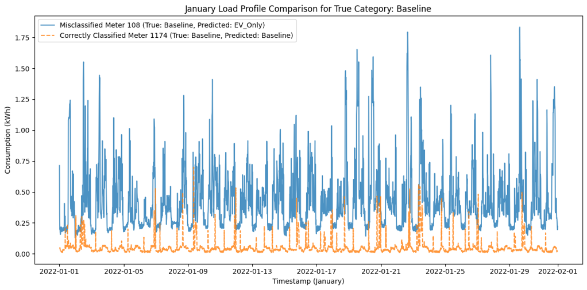

# Smart Meter Household Classification: Results Summary

This document outlines the performance, key predictive features, and diagnostic error analysis of our machine learning models trained to classify household types based on smart meter load profiles.

---

## Model Performance

We evaluated two primary models for this classification task: Logistic Regression and LightGBM. Both models demonstrated strong predictive capabilities across the various household categories (Baseline, EV_Only, EV_PV, HP_PV, PV_Only).

*   **Logistic Regression:** Achieved a validation accuracy of approximately 87.7% and a validation macro-F1 score of 86.6%.
*   **LightGBM:** Reached a validation accuracy of approximately 86.9% and a validation macro-F1 score of 85.5%.

**Detailed Results:**
*Please reference the classification reports and confusion matrices below for class-specific performance.*

---

## Feature Importance & Key Signatures

Our feature extraction pipeline transforms high-frequency, 15-minute load profiles into actionable daily aggregated indicators and 24-hour diurnal profiles. As illustrated below, a specific set of features heavily drives the model's decision-making process.

### Key Driving Features

*   **`base_load` & `std`:** Serve as the most prominent discriminators for distinguishing continuously active thermal equipment from volatile charging spikes. 
*   **`avg_injection_morning` & `avg_injection_afternoon`:** Provide the strongest predictive signals for detecting active Solar PV generation during peak solar irradiance windows.
*   **`autocorr_24` & `autocorr_1`:** Act as diurnal persistence metrics to differentiate highly predictable residential routines from irregular, high-draw consumption cycles.
*   **`midday_dip`:** Effectively captures behind-the-meter solar self-consumption, which offsets daytime grid demand.

---

## Diagnostic Error Analysis

To better understand the model's classification edge cases, we systematically analyzed misclassified load profiles against established ground-truth baselines. 

### Case Study: Meter 108

*   **True Label:** `Baseline`
*   **Predicted Label:** `EV_Only`

**Observation:**  
The consumer profile for Meter 108 exhibits sporadic, high-amplitude power spikes (frequently reaching between 1.0 and 1.8 kWh per 15-minute interval) during January. This contrasts sharply with correctly classified standard baseline households (e.g., Meter 1174), which consistently register low consumption, typically remaining well below 0.5 kWh per interval.

**Root Cause:**  
High-draw domestic appliances—such as resistive space heaters or instantaneous water heaters—can closely mimic the signature of non-scheduled EV charging behavior. In winter months, these appliances generate consumption spikes that inadvertently trigger false-positive `EV_Only` detections in the classifier.
